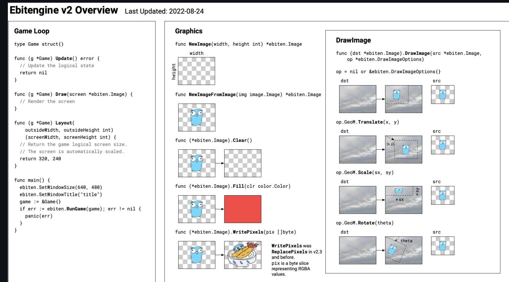

# Golang 实现桌面宠物


宠物模型为ji你太美的**坤坤**，效果如下：

1. 宠物会追踪鼠标并移动；
2. 点击宠物会发出声音并改变形态；


项目地址 https://github.com/gofish2020/ikun 欢迎Fork && Star


本程序基于 `github.com/hajimehoshi/ebiten` 游戏引擎，我们只需要实现 `Game`接口即可。




## 源码走读

- 读取配置信息
- 打印Slogan
- 读取图片+音频资源
- 创建窗体，并且传入实现了`Game`接口的结构体。这里就是`ikun`结构体

```go
func main() {

	// 读取配置信息
	config.PrefixEnv = "IKUN"
	config.File = "ikun.ini"
	config.Parse(cfg)

	//打印Slogan
	fmt.Println("IKun爱坤程序,可以不爱,但别伤害～")

	mSprite = make(map[string]*ebiten.Image)
	mSound = make(map[string][]byte)

	// 读取 material中的所有的资源（图片/音频）
	a, _ := fs.ReadDir(f, "material")

	for _, v := range a {
		// 读取文件内容
		data, _ := f.ReadFile("material/" + v.Name())

		// 去掉文件名后缀（只剩下文件名）
		name := strings.TrimSuffix(v.Name(), filepath.Ext(v.Name()))
		// 文件后缀
		ext := filepath.Ext(v.Name())

		switch ext {
		case ".png":
			// 如果是图片，加载图片为 image.Image
			img, _, err := image.Decode(bytes.NewReader(data))
			if err != nil {
				log.Fatal(err)
			}

			mSprite[name] = ebiten.NewImageFromImage(img) // 转换成 *ebiten.Image 类型
		case ".wav":
			// 如果是音频，读取 *wav.Stream
			stream, err := wav.DecodeWithSampleRate(44100, bytes.NewReader(data))
			if err != nil {
				log.Fatal(err)
			}
			// 这里的data 应该是pcm原始数据
			data, err := io.ReadAll(stream)
			if err != nil {
				log.Fatal(err)
			}

			mSound[name] = data
		}
	}

	audio.NewContext(44100)
	audio.CurrentContext().NewPlayerFromBytes([]byte{}).Play() // 类似于预热的感觉（可能是库有bug）

	ebiten.SetRunnableOnUnfocused(true) // 游戏界面不显示，依然运行
	ebiten.SetScreenClearedEveryFrame(false)
	ebiten.SetTPS(50)            // 窗口刷新频率
	ebiten.SetVsyncEnabled(true) // 垂直同步
	ebiten.SetWindowDecorated(false)
	ebiten.SetWindowFloating(true)                                                      // 置顶显示
	ebiten.SetWindowMousePassthrough(cfg.MousePassthrough)                              // 鼠标穿透
	ebiten.SetWindowSize(int(float64(width)*cfg.Scale), int(float64(height)*cfg.Scale)) // 窗口大小
	ebiten.SetWindowTitle("IKun")

	iKun := &ikun{
		x:       monitorWidth / 2,
		y:       monitorHeight / 2,
		count:   0,
		min:     50,
		picName: strconv.Itoa(r.Intn(8)), // 默认显示的图片
	}

	err := ebiten.RunGameWithOptions(iKun, &ebiten.RunGameOptions{
		InitUnfocused:     true, // 启动时候，窗体不聚焦
		ScreenTransparent: true, // 窗体透明
		SkipTaskbar:       true, // 图片不显示在任务栏
		X11ClassName:      "IKun",
		X11InstanceName:   "IKun",
	})
	if err != nil {
		log.Fatal(err)
	}
}

```

看下 `ikun`结构体实现（源码注释的很清晰）

```go
type ikun struct {
	// 窗体的屏幕坐标
	x int
	y int

	distance int  // 鼠标和窗体的距离
	isFlag   bool // 从true变为false，表示窗体和鼠标，从不在一起到在一起； 从 false变为true，表示窗体和鼠标，从在一起到不在一起

	picName     string // 当前显示的图片
	lastPicName string // 上次显示的图片

	waiting bool // 窗体是否固定（不移动）
	count   int  // 图片的切换频率
	min     int
	max     int
}

// 窗口大小
func (i *ikun) Layout(outsideWidth, outsideHeight int) (screenWidth, screenHeight int) {
	return width, height
}

func (i *ikun) Draw(screen *ebiten.Image) {

	if i.waiting { // 不能移动状态

		// 在两种图片之间切换
		if i.count < i.min {
			i.picName = "wait0"
		} else if i.count >= i.min && i.count < i.max {
			i.picName = "wait1"
		} else {
			i.count = 0
		}
	} else if i.isFlag { // 可以移动 && 鼠标和窗体不在一起

		// i.count 自增大于 i.min切换一次图片
		if i.count > i.min {
			i.count = 0
			i.picName = strconv.Itoa(r.Intn(8)) // 随机
			//playSound(mSound["ji"])
		}
	}

	pic := i.picName
	if i.lastPicName == pic {
		return
	}

	i.lastPicName = pic

	img := mSprite[pic]
	screen.Clear()
	screen.DrawImage(img, nil)
}

func (i *ikun) Update() error {
	// 鼠标点击（切换状态）
	if inpututil.IsMouseButtonJustPressed(ebiten.MouseButtonLeft) {
		if i.waiting {
			playSound(mSound["wa"])
			i.picName = strconv.Itoa(r.Intn(8))
			i.count = 0
			i.min = 50
			i.max = 100
		} else {
			playSound(mSound["ganma"])
			i.count = 0
			i.min = 10
			i.max = 20
		}
		i.waiting = !i.waiting
	}

	i.count++
	// 等待中..
	if i.waiting {
		return nil
	}
	// 保证窗体的屏幕坐标 i.x i.y 处于屏幕的范围内，而不会跑到屏幕外面
	i.x = max(0, min(i.x, monitorWidth))
	i.y = max(0, min(i.y, monitorHeight))

	// 将界面移动到当前位置
	ebiten.SetWindowPosition(i.x, i.y)

	// 鼠标相对于【游戏窗口】的【中点】的距离
	mx, my := ebiten.CursorPosition()
	x := mx - (height / 2)
	y := my - (width / 2)

	// dy/dx 为了做distance计算（临时的）
	dy, dx := y, x
	if dy < 0 {
		dy = -dy
	}
	if dx < 0 {
		dx = -dx
	}
	i.distance = dx + dy

	if i.distance < width {

		// 当鼠标和窗体碰一起的时候（并且是从不接触到接触），发出一声 "鸡"
		if i.isFlag {
			playSound(mSound["ji"])
		}
		i.isFlag = false
	} else { // 窗体和鼠标不在一起
		i.catchCursor(x, y)
	}

	return nil
}

func (i *ikun) catchCursor(x, y int) {

	i.isFlag = true
	// 弧长
	r := math.Atan2(float64(y), float64(x))
	tr := 0.0
	if r <= 0 {
		tr = 360
	}
	// 弧长转圆心角
	a := (r / math.Pi * 180) + tr

	// 按照45度一个扇面，将360度分割成8个扇面
	switch {
	case a <= 292.5 && a > 247.5: // 上
		i.y -= cfg.Speed
	case a <= 337.5 && a > 292.5: // 右上
		i.x += cfg.Speed
		i.y -= cfg.Speed
	case a <= 22.5 || a > 337.5: // 右
		i.x += cfg.Speed
	case a <= 67.5 && a > 22.5: // 右下
		i.x += cfg.Speed
		i.y += cfg.Speed
	case a <= 112.5 && a > 67.5: //下
		i.y += cfg.Speed
	case a <= 157.5 && a > 112.5: // 左下
		i.x -= cfg.Speed
		i.y += cfg.Speed
	case a <= 202.5 && a > 157.5: //左
		i.x -= cfg.Speed
	case a <= 247.5 && a > 202.5: // 左上
		i.x -= cfg.Speed
		i.y -= cfg.Speed
	}

}

func playSound(sound []byte) {

	if cfg.Quiet {
		return
	}

	if currentplayer != nil && currentplayer.IsPlaying() {
		currentplayer.Close()
	}
	currentplayer = audio.CurrentContext().NewPlayerFromBytes(sound)
	currentplayer.SetVolume(.3)
	currentplayer.Play()
}
```


## 启动参数

把代码下载到本地直接 `go run main.go`即可直接看到效果

-mousepassthrough 鼠标是否穿透窗体 (default false).
-quiet 是否静音 (default false)
-scale 缩放窗体 (default 2.0).
-speed kunkun移动的像素 (default 2).
-h Show help.


## 参考资料

参考代码：
https://github.com/crgimenes/neko

更多游戏范例：
https://github.com/sedyh/awesome-ebitengine?tab=readme-ov-file#games

